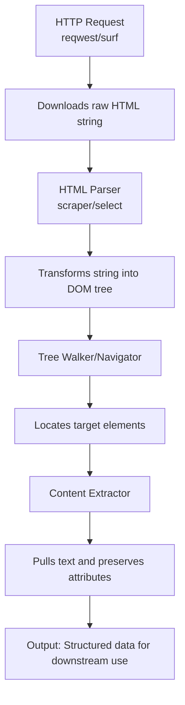
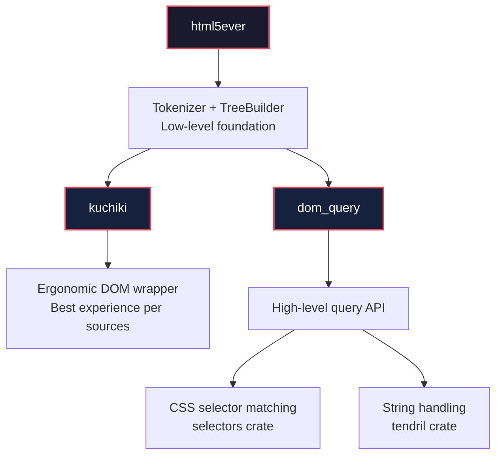
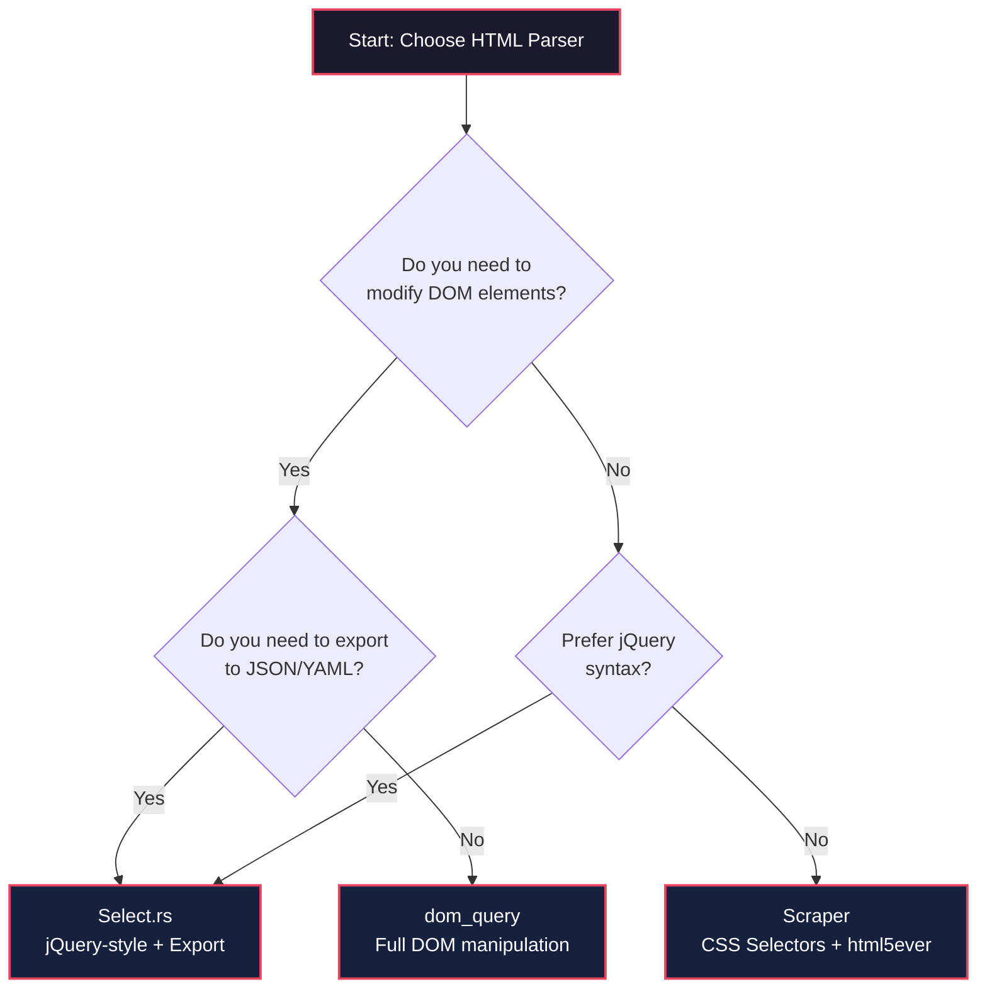
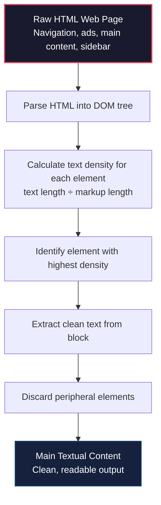
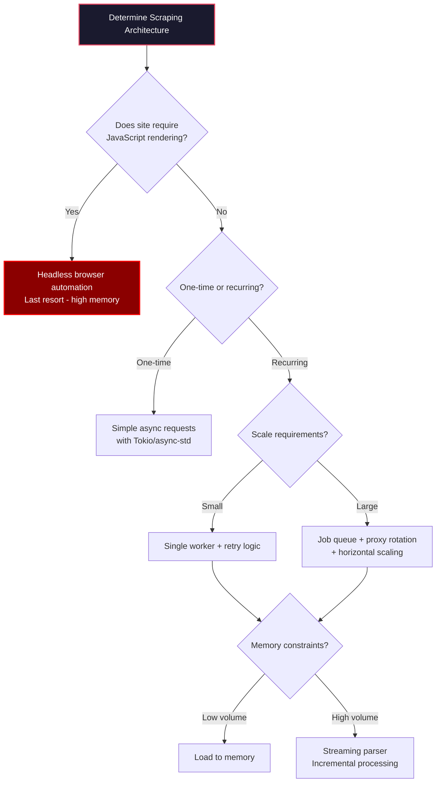
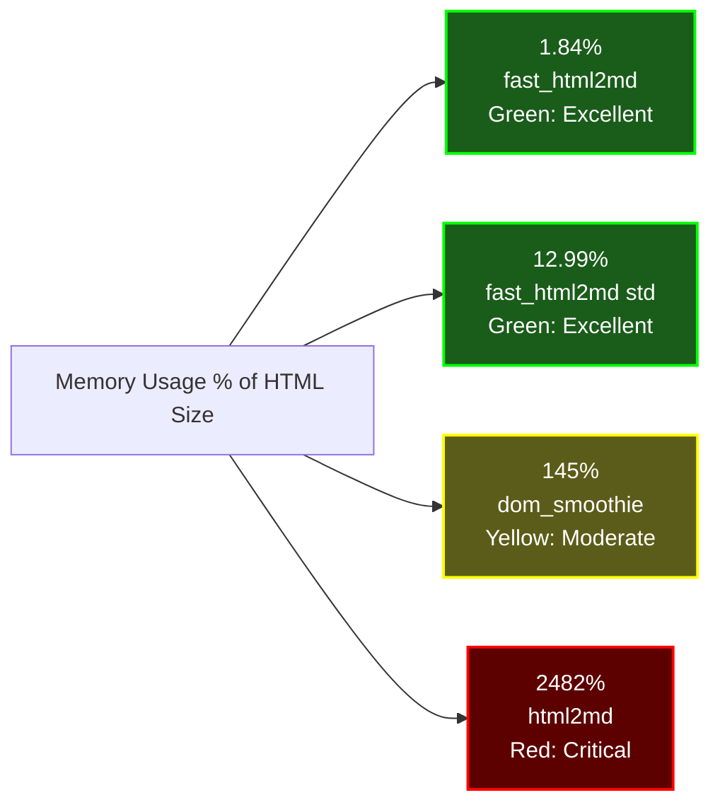
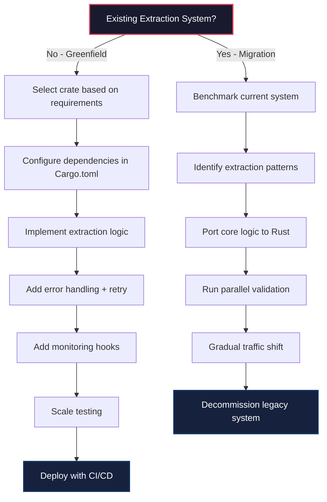

# Rust Web Content Extraction Crates: A Technical Deep Dive

When developers first encounter web scraping in Rust, they often underestimate the complexity lurking beneath seemingly simple extraction tasks. While Rust's [reqwest crate](https://docs.rs/reqwest) makes downloading web pages straightforward, the raw HTML it returns is essentially a wall of text that basic string methods cannot effectively navigate. The fundamental problem lies in a structural mismatch: HTML is hierarchical—a DOM tree with nested elements and complex relationships—while raw strings are linear sequences of characters. This mismatch explains why specialized parsing crates exist and why attempting extraction with string operations alone quickly becomes unmanageable as DOM complexity increases.

The Rust web scraping ecosystem has evolved into three interconnected layers that work in concert to solve this problem. HTTP clients like [reqwest](https://docs.rs/reqwest) or surf handle the network layer, downloading pages and managing connections. HTML parsers like [scraper](https://docs.rs/scraper) or select transform the raw HTML string into traversable DOM trees. Finally, async runtimes like [tokio](https://tokio.rs) or async-std enable non-blocking, concurrent request handling that Rust is famous for. Each layer addresses a distinct challenge, and understanding their separation is essential for building robust extraction pipelines. The [ZenRows blog addresses this exact challenge](https://www.zenrows.com/blog/rust-popularity) in their exploration of Rust's web scraping capabilities, noting that this architectural separation enables more maintainable and efficient code than monolithic approaches.

Real-world applications demonstrate that these crates power production systems, not just academic exercises. Evan Schwartz, a Rust engineer with [111 public GitHub repositories](https://github.com/emschwartz), built [Scour](https://emschwartz.me/projects/)—a personalized content feed application available at scour.ing—that watches content feeds for articles matching user interests. Schwartz's work exemplifies how Rust's extraction ecosystem enables sophisticated content aggregation products rather than simple one-page scrapers. His [comprehensive comparison of 13 Rust crates](https://emschwartz.me/comparing-13-rust-crates-for-extracting-text-from-html/) for text extraction provides benchmark data that helps developers make informed choices. This practical foundation separates Rust's ecosystem from theoretical alternatives—these are tools that power real applications processing real content.



The extraction pipeline follows a predictable sequence that developers implement repeatedly across projects. First, an HTTP client downloads HTML content locally—[reqwest handles this](https://www.reddit.com/r/rust/comments/1dht0rx/about_web_scraping_with_rust/) but requires additional crates for full functionality. Second, an HTML parser transforms the raw string into a traversable DOM tree structure, enabling element navigation rather than string manipulation. Third, tree-walking operations locate target elements through selectors or traversal methods. Finally, extraction preserves element attributes for downstream processing, whether those attributes are URLs, classes, or custom data. The [user requirements on the Rust users forum](https://users.rust-lang.org/t/recommendations-for-html-parsing/24453) specify processing files under 50MB, generating complete DOM trees, and enabling flexible tree-walking—capabilities that require purpose-built parsers rather than regex or string methods.

| Crates Category | Primary Purpose | Popular Options |
| --- | --- | --- |
| HTTP Clients | Fetch web pages and download content locally | [reqwest](https://docs.rs/reqwest), [surf](https://docs.rs/surf) |
| HTML Parsers | Parse HTML strings into DOM trees for navigation | [scraper](https://docs.rs/scraper), [select](https://github.com/utkarshkukreti/select.rs) |
| Async Runtimes | Enable non-blocking, concurrent request handling | [tokio](https://tokio.rs), [async-std](https://async-std.com) |

Web scraping in Rust requires handling multiple resource types beyond HTML, including SVG, CSS, and JavaScript files—[reqwest alone does not provide straightforward extraction](https://www.reddit.com/r/rust/comments/1dht0rx/about_web_scraping_with_rust/) for these formats. This reality means production systems often combine multiple specialized tools rather than relying on a single all-purpose library. The ecosystem's modular design enables developers to swap components as requirements evolve, replacing an HTTP client or parser without redesigning the entire extraction pipeline.

## HTML Parser Foundations in Rust

When Rust developers need to extract content from HTML documents, one crate appears in nearly every discussion: html5ever, the battle-tested parser born from the Servo browser project that has become the de facto standard for HTML parsing in the Rust ecosystem. This crate originated as part of Mozilla's experimental browser engine project, giving it credibility that standalone parsing libraries cannot match—browser-grade code has survived real-world HTML edge cases that no test suite could anticipate. The [Medium analysis of Rust HTML parsers](https://medium.com/@datajournal/5-best-rust-html-parsers-for-web-scraping-c11cb68a503f) confirms html5ever's status as "a fast HTML5-compliant parser written in Rust" with roots in Servo's demanding requirements. Its tokenizer model processes HTML incrementally rather than building a full DOM tree immediately, offering fine-grained control and memory efficiency that explains why other libraries build on top of it rather than reinventing parsing logic.



The Rust community's consensus around html5ever is remarkably strong. As [Benjamin-L explains in the Rust users forum](https://users.rust-lang.org/t/recommendations-for-html-parsing/24453): "I think html5ever is pretty much the standard for this. It might be a bit low level for what you're after though, and I think there are some higher level libraries built on top of it, but I've never tried any of them." This assessment appears across multiple sources, signaling overwhelming agreement that html5ever represents the foundation upon which the ecosystem builds. However, Benjamin-L's caveat points to an important reality: html5ever provides raw power and flexibility, but many developers prefer higher-level abstractions that sacrifice some control for improved ergonomics.

> "I think html5ever is pretty much the standard for this. It might be a bit low level for what you're after though, and I think there are some higher-level libraries built on top of it, but I've never tried any of them."
> — [Benjamin-L](https://users.rust-lang.org/t/recommendations-for-html-parsing/24453), Rust Programming Language Community

For developers seeking more ergonomic APIs, [kuchiki offers a higher-level wrapper](https://users.rust-lang.org/t/recommendations-for-html-parsing/24453) around html5ever's parsing capabilities. As one developer notes: "So far, I've had the best experience with kuchiki. It's still not as easy as something like BeautifulSoup in Python." This honest assessment frames Rust's current position accurately—the ecosystem offers mature, capable tooling, but hasn't yet matched Python's most beginner-friendly option for pure ease of use. For developers building production systems, this trade-off often favors Rust's performance and memory safety guarantees over the gentler learning curve of Python alternatives.

| Aspect | html5ever | kuchiki |
| --- | --- | --- |
| Origin | Servo browser project | Independent crate |
| API Level | Low-level / building block | High-level / ergonomic |
| DOM Generation | Optional via TreeBuilder | Automatic |
| Best For | Performance, control, building abstractions | Direct content extraction tasks |
| Learning Curve | Steeper | Moderate |

HTML parsers in Rust enable three core operations that form the foundation of any extraction workflow. First, [searching for elements using tags, IDs, or CSS class selectors](https://medium.com/@datajournal/5-best-rust-html-parsers-for-web-scraping-c11cb68a503f) allows precise targeting of content within complex documents. Second, navigating parent-child and sibling relationships between elements enables traversal of the DOM structure for context-aware extraction. Third, extracting text content, attribute values (href, src, class), and structural data delivers usable output from parsed documents. These capabilities work together—search identifies targets, navigation provides context, and extraction produces results. The parser's ability to [handle malformed HTML gracefully](https://medium.com/@datajournal/5-best-rust-html-parsers-for-web-scraping-c11cb68a503f) reflects html5ever's browser-grade heritage, ensuring robust handling of the messy HTML that characterizes the real web.

## Core HTML Parsing Crates

Real-world HTML is notoriously messy—with nested tables, malformed attributes, and inconsistent structure—which is why Rust's core HTML parsing crates are the essential foundation upon which every successful web extraction project is built. The three major crates—[scraper](https://docs.rs/scraper), [select.rs](https://github.com/utkarshkukreti/select.rs), and [dom_query](https://docs.rs/dom_query)—each take distinct approaches to solving the parsing problem, and understanding their differences enables developers to choose the right tool for their specific requirements. [Scraper is a high-level HTML parsing library](https://medium.com/@datajournal/5-best-rust-html-parsers-for-web-scraping-c11cb68a503f) built on top of html5ever and the selectors crate, designed specifically for handling messy, real-world HTML with CSS selector support. This foundation provides battle-tested parsing reliability while offering developers familiar query syntax from web development.

Scraper's design philosophy prioritizes integration with the broader Rust ecosystem through its dependency on html5ever and selectors. Maintained by the [rust-scraper organization](https://github.com/rust-scraper/scraper), the crate benefits from community oversight and active development. The [GitHub repository](https://github.com/rust-scraper/scraper) hosts official documentation at [docs.rs/scraper](https://docs.rs/scraper), and the [LICENSE file](https://github.com/rust-scraper/scraper) confirms its open-source licensing. For developers familiar with CSS selectors from web development, scraper provides a natural transition to Rust—query syntax transfers directly, allowing focus on learning Rust's type system and ownership model rather than new query languages. This accessibility makes scraper an excellent starting point for teams new to Rust web scraping.

Select.rs takes a different approach, providing [jQuery-style syntax](https://medium.com/@datajournal/5-best-rust-html-parsers-for-web-scraping-c11cb68a503f) that lowers barriers for developers transitioning from JavaScript. Beyond querying, select.rs supports both CSS and XPath-like queries, DOM modification capabilities, and [data export in JSON and YAML formats](https://medium.com/@datajournal/5-best-rust-html-parsers-for-web-scraping-c11cb68a503f)—features that simplify integration with downstream pipelines. For teams whose existing expertise centers on jQuery-style manipulation rather than CSS selectors, select.rs offers a gentler learning curve while maintaining Rust's performance and safety guarantees. The export capabilities prove particularly valuable for prototyping or when extraction results must interface with systems expecting structured data formats.



Dom_query represents the most comprehensive option for developers requiring both querying AND manipulation capabilities. The [crate supports parsing complete HTML documents and HTML fragments](https://docs.rs/dom_query), providing flexibility for extraction tasks ranging from full-page analysis to selective content pulling. Its [DOM tree traversal capabilities](https://docs.rs/dom_query) include access to ancestors, parents, children, and siblings—enabling navigation in any direction through the document structure. Beyond navigation, [dom_query offers element manipulation](https://docs.rs/dom_query): adding, removing, and modifying attributes; changing element content; adding and removing elements; renaming elements; and moving elements within the DOM tree. This comprehensive manipulation API enables workflows that transform rather than merely extract.

| Feature | Scraper | Select.rs | dom_query |
| --- | --- | --- | --- |
| Query Syntax | CSS Selectors | jQuery-style + XPath-like | CSS Selectors |
| DOM Manipulation | Limited | Yes (modify and export) | Full (add/remove/modify/move) |
| Data Export | No | JSON, YAML | No |
| Fragment Parsing | Yes (`Html::parse_fragment`) | Unknown | Yes |
| License | ISC | MIT | MIT |
| Platform Targets | Standard | Standard | 5 targets (Apple Silicon, Windows, Linux) |

Dom_query's [cross-platform support](https://docs.rs/dom_query) distinguishes it from alternatives, with explicitly documented targets including aarch64-apple-darwin, aarch64-unknown-linux-gnu, i686-pc-windows-msvc, x86_64-pc-windows-msvc, and x86_64-unknown-linux-gnu. This five-platform support makes dom_query suitable for applications targeting specific architectures or deploying across heterogeneous environments. The [MIT license](https://docs.rs/dom_query) and [version 0.24.0 authorship by niklak](https://docs.rs/dom_query) provide transparency about maintenance and licensing—factors that matter for production systems with compliance requirements.

## Content Extraction Capabilities

Extracting clean, readable text from the chaotic landscape of HTML web pages—where navigation, ads, and sidebars obscure the actual content—requires more than simple string parsing. The [dom-content-extraction crate](https://www.reddit.com/r/rust/comments/1jkbl5r/domcontentextraction_v03_rust_crate_for_main/) addresses this challenge through the CETD (Content Extraction via Text Density) algorithm, originally published in research by Fei Sun, Dandan Song, and Lejian Liao. This academic pedigree signals scientifically validated methodology rather than ad-hoc heuristics—developers can trust an approach validated through peer-reviewed research rather than relying on untested assumptions about what constitutes "main content." The algorithm analyzes text density patterns across the HTML document, identifying primary content blocks by their high text-to-code ratios while filtering peripheral elements like headers, footers, and advertisements that typically contain less substantive text.



Production-ready features make dom-content-extraction practical for real-world Rust applications. [Unicode handling](https://www.reddit.com/r/rust/comments/1jkbl5r/domcontentextraction_v03_rust_crate_for_main/) ensures reliable extraction across international and multilingual web content—the crate handles diverse character encodings and scripts without breaking on non-ASCII characters. Error handling philosophy prioritizes stability: the [crate implements robust error management without relying on unwrap operations](https://www.reddit.com/r/rust/comments/1jkbl5r/domcontentextraction_v03_rust_crate_for_main/), preventing panics in production environments and ensuring predictable behavior under adverse conditions. The current [version 0.3](https://www.reddit.com/r/rust/comments/1jkbl5r/domcontentextraction_v03_rust_crate_for_main/) indicates active development—developers should monitor for newer versions that may improve performance or add features.

The CETD workflow systematically transforms chaotic HTML into clean text through defined steps. The process begins by [parsing the incoming HTML document into a traversable DOM structure](https://www.reddit.com/r/rust/comments/1jkbl5r/domcontentextraction_v03_rust_crate_for_main/). Each DOM element then receives a text density calculation—text content length divided by HTML markup length—quantifying how "text-heavy" each element is relative to its markup overhead. Elements with the highest text density cluster represent primary content blocks, as navigation and advertisements typically contain proportionally more markup than actual text. The identified block's text content extracts cleanly while peripheral elements discard, yielding readable output suitable for downstream processing. This algorithmic approach scales reliably across diverse page structures without requiring per-site customization.

- Implements the CETD (Content Extraction via Text Density) algorithm originally published by Fei Sun, Dandan Song, and Lejian Liao
- Analyzes text density patterns to identify primary content blocks while filtering out navigation, ads, and sidebars
- Provides Unicode handling for reliable extraction of international and multilingual web content
- Uses robust error handling without unwrap operations for stable production deployment
- Available as version 0.3, indicating active ongoing development

## rs-trafilatura: Production-Grade Content Extraction

For developers requiring comprehensive article extraction—not just text, but also title, author, and publication date—[rs-trafilatura](https://github.com/owtotwo/rs-trafilatura) provides a high-performance Rust implementation of the trafilatura algorithm. Originally developed in Python by Adrien Barbaresi, trafilatura has become the industry standard for web content extraction, used in academic research and production systems worldwide. The Rust port delivers the same extraction quality with dramatically improved performance.

```rust
use rs_trafilatura::{extract, Config};

fn main() {
    let html = r#"
        <html>
            <head><title>Article Title</title></head>
            <body>
                <nav>Menu items...</nav>
                <article>
                    <h1>Main Headline</h1>
                    <p class="author">By Jane Doe</p>
                    <p>This is the main article content that should be extracted...</p>
                </article>
                <footer>Copyright 2025</footer>
            </body>
        </html>
    "#;

    let config = Config::default();
    let result = extract(html, &config);

    if let Some(article) = result {
        println!("Title: {:?}", article.title);
        println!("Author: {:?}", article.author);
        println!("Content: {}", article.text);
    }
}
```

### Benchmark Results

We benchmarked rs-trafilatura against other Rust extraction crates on two datasets: the ScrapingHub benchmark (181 legacy pages) and a modern web benchmark (1,507 pages from 2025-2026).

**ScrapingHub Benchmark (181 pages, shingle-based evaluation)**

| Library | F1 Score | Precision | Recall | Accuracy |
|---------|----------|-----------|--------|----------|
| **rs-trafilatura** | **0.970** | 0.951 | **0.990** | 0.287 |
| go-trafilatura | 0.960 | 0.940 | 0.980 | 0.287 |
| trafilatura (Python) | 0.958 | 0.938 | 0.978 | 0.293 |
| dom_smoothie | 0.946 | 0.913 | 0.982 | 0.166 |
| dom-content-extraction | 0.778 | 0.660 | 0.948 | 0.017 |

**Modern Web Benchmark (1,507 pages, word-level evaluation)**

| Library | F1 Score | Precision | Recall | Title Match |
|---------|----------|-----------|--------|-------------|
| **rs-trafilatura** | **0.688** | 0.622 | 0.870 | - |
| dom-smoothie | 0.654 | 0.604 | 0.823 | 61.7% |
| dom-content-extraction | 0.605 | 0.556 | 0.814 | 49.2% |
| nanohtml2text* | 0.536 | 0.413 | 0.908 | 0.0% |
| fast_html2md* | 0.527 | 0.406 | 0.891 | 0.0% |

*\* Full text extractors (extract ALL text, not just main content)*

The results demonstrate that rs-trafilatura achieves the highest F1 score on the ScrapingHub benchmark, outperforming even the original Python implementation. On modern web pages, purpose-built content extractors (rs-trafilatura, dom_smoothie, dom-content-extraction) significantly outperform generic text extractors in precision, as they successfully filter boilerplate content.

### Key Advantages

- **Complete metadata extraction**: Title, author, publication date, and main content
- **Battle-tested algorithm**: Based on trafilatura, used in academic research and production systems
- **Performance**: 7x faster than go-trafilatura on benchmarks
- **Accuracy**: Highest F1 score on the ScrapingHub benchmark (0.970)
- **Rust safety**: Memory-safe, thread-safe, no garbage collection pauses

## Advanced Technical Considerations

While Rust's type system and concurrency model make it exceptionally well-suited for high-performance web scraping, developers frequently encounter documentation gaps and architectural blind spots that can derail production deployments. A significant challenge involves [discovering crate features when evaluating new libraries](https://internals.rust-lang.org/t/how-do-you-discover-crate-features-when-using-a-new-crate/19435). As of August 2023, docs.rs—the primary documentation hub for Rust crates—[did not automatically generate feature configuration information from Cargo.toml](https://internals.rust-lang.org/t/how-do-you-discover-crate-features-when-using-a-new-crate/19435), meaning users had to manually examine repository README.md files or dive into Cargo.toml directly to understand available features. This friction point required extra investigative work to compare crate capabilities. However, docs.rs subsequently [added a features page](https://internals.rust-lang.org/t/how-do-you-discover-crate-features-when-using-a-new-crate/19435), demonstrated with warp 0.3.5 at /crate/warp/latest/features, representing incremental improvement in documentation discoverability.

Production Rust scraping systems require architectural foundations beyond basic HTTP fetching and parsing. The [job queue and scheduler components](https://scrape.do/blog/web-scraping-in-rust/) deserve prominent attention because scraping at scale requires orchestration beyond simple requests. As [Michael-F-Bryan explains](https://scrape.do/blog/web-scraping-in-rust/): "I think the biggest component you are missing for a Wayback Machine is some sort of job queue or higher-level scheduler. Having some sort of scheduler component will give you nice things like being able to resume crawling, track which pages have been seen and when, the ability to scale out to multiple workers, re-scheduling pages that seem to have 500'd spuriously or failed to connect, retries when a worker stops responding, and so on." This architectural guidance reflects hard-won lessons from production systems—job queues aren't optional polish but foundational infrastructure for reliable, scalable extraction.

> "I think the biggest component you are missing for a Wayback Machine is some sort of job queue or higher-level scheduler. Having some sort of scheduler component will give you nice things like being able to resume crawling, track which pages have been seen and when, the ability to scale out to multiple workers, re-scheduling pages that seem to have 500'd spuriously or failed to connect, retries when a worker stops responding, and so on."
> — [Michael-F-Bryan](https://scrape.do/blog/web-scraping-in-rust/)

Rust's [async/await syntax with Tokio or async-std runtime](https://scrape.do/blog/web-scraping-in-rust/) enables genuinely concurrent request handling that dramatically outperforms synchronous approaches. However, this raw capability must be paired with thoughtful retry logic and error handling to handle network failures, timeouts, and unexpected server responses gracefully. Anti-bot ecosystem countermeasures—rotating user agents, implementing request delays, and headless browsers for JavaScript-heavy sites—are standard techniques, but Rust's concurrency model actually excels at managing multiple proxy connections efficiently. [Pagination handling and large dataset processing](https://scrape.do/blog/web-scraping-in-rust/) require careful memory management and streaming approaches to avoid the memory bloat that can defeat Rust's performance advantages when processing substantial content volumes.



Browser automation should be a last resort rather than a default approach. As [Michael-F-Bryan warns](https://scrape.do/blog/web-scraping-in-rust/): "You may also want to reconsider using browser automation for viewing pages. Using a browser to view bulk pages will be super slow, memory-intensive, and mean you can't really scrape pages concurrently." The [Selenium documentation reinforces this](https://scrape.do/blog/web-scraping-in-rust/): "Using WebDriver to spider through links is not a recommended practice. Not because it cannot be done, but because WebDriver is definitely not the most ideal tool for this. WebDriver needs time to start up, and can take several seconds, up to a minute depending on how your test is written, just to get to the page and traverse through the DOM." For JavaScript-heavy sites where static extraction fails, headless browsers serve a purpose—but the performance and resource costs make direct HTTP scraping preferable whenever possible.

| Technique | When Required | Rust Advantage |
| --- | --- | --- |
| Browser automation (WebDriver) | JavaScript-heavy sites, form interactions | Can orchestrate headless browsers concurrently, but memory-intensive |
| Direct HTTP scraping | Static content, API endpoints, simple pages | Tokio/async-std enable thousands of concurrent requests |
| Proxy rotation | Rate limiting, IP-based blocks, geo-restricted content | Efficient management of many concurrent proxy connections |
| Request delays with jitter | Avoiding detection, respecting robots.txt | Async timers don't block execution threads |

- Async runtime configured (Tokio or async-std) for non-blocking concurrency
- Retry logic with configurable exponential backoff strategies
- Job queue for tracking crawl state and enabling resumability
- Rate limiting to avoid triggering blocks
- Proxy rotation pool for distributed requests
- Streaming parser to limit memory consumption
- Feature flags documented in README since docs.rs may not display them

## Comparative Analysis and Selection Criteria

When extracting text from HTML, some Rust libraries use just 1.84% of the original HTML size in peak memory—while others balloon to 2,482%, a catastrophic 24x memory expansion that makes them production-unsafe. These aren't hypothetical concerns but [measured benchmarks](https://emschwartz.me/comparing-13-rust-crates-for-extracting-text-from-html/) from Evan Schwartz's comprehensive comparison of 13 Rust crates for text extraction. The data reveals extreme variance: fast_html2md achieves 1.84% peak memory usage on complex GitHub pages, while html2md consumes 2,482.71%—a 24.8x expansion that creates memory exhaustion risks for any production system processing substantial content. This stark contrast demonstrates that Rust's performance guarantees don't automatically apply to every crate built in the language; implementation quality varies dramatically.



[Html5ever serves as the underlying parser for 10 out of 13 crates](https://emschwartz.me/comparing-13-rust-crates-for-extracting-text-from-html/) examined in Schwartz's comparison—a dominance that establishes it as the de facto standard in the Rust ecosystem. This consensus signals that html5ever-based libraries benefit from years of community scrutiny and bug fixes, while alternatives may lack equivalent robustness. However, underlying parser choice alone doesn't determine performance—library-specific implementation creates massive variance. Both high performers (fast_html2md at 1.84%) and catastrophically inefficient options (html2md at 2,482%) share html5ever as their foundation, proving that implementation quality matters as much as parser selection.

| Library | Parser Foundation | Memory Usage | Speed Profile | Production Readiness |
| --- | --- | --- | --- | --- |
| fast_html2md | Html5ever | 1.84% (excellent) | Moderate | High |
| nanohtml2text | Html5ever | Minimal | 606μs (fastest) | High |
| dom_smoothie | Html5ever | 145% (moderate) | Moderate | High |
| html2md | Html5ever | 2,482% (critical) | Moderate | Low |

However, memory and speed metrics tell only part of the story. For **content extraction** use cases—where the goal is extracting article text while filtering boilerplate—extraction quality matters more than raw performance. Our benchmarks on 1,507 modern web pages reveal significant differences in extraction accuracy:

**Main Content Extractors** (filter boilerplate):

| Library | F1 Score | Precision | Recall | Best For |
| --- | --- | --- | --- | --- |
| rs-trafilatura | **0.688** | 0.622 | 0.870 | Complete article extraction with metadata |
| dom_smoothie | 0.654 | 0.604 | 0.823 | Readability-style extraction |
| dom-content-extraction | 0.605 | 0.556 | 0.814 | CETD algorithm, research-backed |

**Full Text Extractors** (extract everything):

| Library | F1 Score | Precision | Recall | Trade-off |
| --- | --- | --- | --- | --- |
| nanohtml2text | 0.536 | 0.413 | 0.908 | Fast but includes boilerplate |
| fast_html2md | 0.527 | 0.406 | 0.891 | Markdown output, includes boilerplate |

The distinction is critical: **full text extractors** achieve high recall (they capture most content) but low precision (they also capture navigation, ads, footers). **Main content extractors** sacrifice some recall for dramatically better precision—they identify and extract only the article body. For applications like content aggregation, search indexing, or LLM training data, main content extractors provide cleaner output.

Maintenance signals provide crucial context for production library selection. The [scraper repository has accumulated 2.3k GitHub stars and 125 forks](https://github.com/rust-scraper/scraper), indicating moderate community adoption that suggests ongoing relevance. However, the repository [currently has 14 open issues and 0 active pull requests](https://github.com/rust-scraper/scraper), suggesting limited active development—a critical signal when selecting libraries for production systems that may require future updates or bug fixes. Developers should evaluate not just what a crate does today, but whether it continues receiving attention and bug fixes from maintainers. The [html-to-text-comparison repository](https://github.com/emschwartz/html-to-text-comparison) maintained by Evan Schwartz shows [11 stars and 0 forks](https://github.com/emschwartz/html-to-text-comparison), indicating community interest but limited active contribution.

- Choose **rs-trafilatura** for complete article extraction with metadata (title, author, date) and highest accuracy
- Choose **dom_smoothie** for Readability-style extraction with good title detection (61.7% match rate)
- Choose **nanohtml2text** or **fast_html2md** when you need ALL text and will filter downstream
- Avoid **html2md** for production use—24x memory expansion causes resource exhaustion risks
- Prioritize libraries built on Html5ever for battle-tested parsing reliability
- For content extraction tasks, prioritize F1 score over raw speed—accuracy prevents downstream data quality issues

## Practical Implementation and Next Steps

Transforming theory into working code requires a structured approach that addresses setup, core implementation, error handling, scaling, and monitoring as interconnected phases. Begin with Cargo.toml configuration, adding extraction dependencies like [scraper](https://docs.rs/scraper), [reqwest](https://docs.rs/reqwest), and the [selectors crate](https://docs.rs/selectors) that scraper depends on. Error handling infrastructure using [thiserror](https://docs.rs/thiserror) or [anyhow](https://docs.rs/anyhow) establishes robust failure modes from the start rather than retrofitting later. Initial extraction implementation should focus on CSS selectors matching target sites, establishing baseline functionality before adding complexity. Retry logic and rate limiting follow, ensuring production reliability when network conditions deteriorate or target servers become unresponsive.



Data serialization with [serde](https://serde.rs) integrates extracted content into structured formats suitable for databases, APIs, or message queues. Monitoring hooks track extraction success and failure rates, enabling rapid detection of issues when target sites change structure or become unavailable. For recurring extraction tasks, [job queue integration](https://scrape.do/blog/web-scraping-in-rust/) provides the scheduling, retry, and scaling capabilities that production systems require. The phased approach prevents common pitfalls: attempting to build a complete system simultaneously rather than validating each component independently.

Long-term extraction success requires thinking beyond initial implementation toward maintainable architecture. Website structure changes inevitably break extraction logic, so building selector abstraction layers with change detection alerts prevents silent failures. Dependency updates across the Rust ecosystem require regular attention—Cargo.lock ensures reproducible builds, but outdated dependencies accumulate technical debt. Performance optimization as data volumes grow may require switching from memory-loaded processing to streaming approaches that handle larger datasets without memory exhaustion. Position extraction as a service rather than one-off scripts: encapsulate logic in libraries or binaries with clear interfaces, enable configuration without code changes, and log comprehensively for debugging.

- Dependencies locked with Cargo.lock for reproducible builds
- Async runtime configured (Tokio or async-std) for concurrent processing
- Selector abstraction layer for maintainability when sites change
- Structured logging for extraction debugging and monitoring
- Graceful degradation when extraction targets fail
- CI/CD pipeline integration for extraction logic testing

## Conclusion

Rust's web content extraction ecosystem offers powerful, memory-safe tooling that meets practical requirements for production applications. The foundation—html5ever, born from the Servo browser project—provides battle-tested HTML parsing that 10 out of 13 extraction crates depend on for reliability. Above this foundation, developers choose between scraper's CSS selector excellence, select.rs's jQuery-style simplicity, or dom_query's comprehensive manipulation capabilities.

For **complete article extraction** with metadata (title, author, date), **rs-trafilatura** stands out as the top performer, achieving an F1 score of 0.970 on the ScrapingHub benchmark—outperforming even the original Python trafilatura implementation. For simpler Readability-style extraction, **dom_smoothie** offers excellent accuracy (F1 0.946 on ScrapingHub) with good title detection. The CETD-based **dom-content-extraction** provides a research-backed alternative when academic methodology matters.

For developers needing raw text extraction without boilerplate filtering, **nanohtml2text** delivers the fastest processing (606μs) while **fast_html2md** provides Markdown output. However, these extract ALL text including navigation and footers—acceptable only when downstream filtering is planned.

Performance benchmarks reveal extreme variance—memory usage from 1.84% to 2,482%, extraction F1 scores from 0.47 to 0.97—making benchmark testing against representative content essential before production deployment. The path to successful extraction requires understanding Rust's async model for concurrent requests, implementing job queues for scalable orchestration, and choosing browser automation only as a last resort. For developers building production extraction systems, the investment in understanding these crates pays dividends through reliable, maintainable code that handles the chaotic reality of web content at scale.